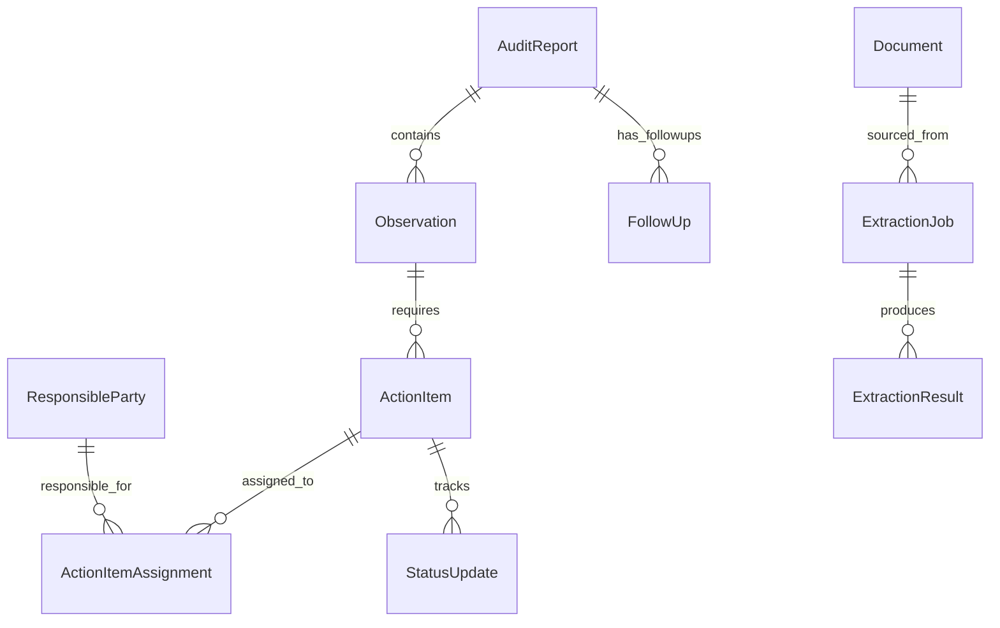

# Internal Audit (Audit Dashboard)

The Audit Dashboard is an observation tracking and follow-up management system built for the University of Idaho's Office of Internal Audit. It ingests published audit reports -- typically delivered as PDFs -- extracts structured observation and action-item data using an on-premises AI pipeline, and provides a dashboard for tracking remediation progress over time. The system replaces a manual spreadsheet-based tracking process, giving auditors a searchable, filterable view of all outstanding observations and their resolution status across the institution.

## Key Statistics

| Attribute | Value |
|---|---|
| **Domain** | Audit observation tracking |
| **Repository** | [github.com/ui-insight/AuditDashboard](https://github.com/ui-insight/AuditDashboard) |
| **Total Tables** | 13 |
| **AllowedValue Groups** | 8 (32 controlled values) |
| **Auth Model** | JWT with 2 roles (admin, auditor) |
| **Stack** | FastAPI + SQLAlchemy 2.0 + React/TypeScript + TailwindCSS |
| **AI** | MindRouter on-prem (dots.OCR + Qwen3-32B) |
| **Prod URL** | Port 9380 |
| **Dev URL** | Port 9390 |

## Entity Relationship Diagram

## Table Inventory

### Core Audit Entities

| Table | Description |
|---|---|
| `AuditReport` | A published internal audit report covering a specific area, process, or unit. Contains the report title, audit period, issuing auditor, and publication date. Serves as the top-level container for observations. |
| `Observation` | A specific finding within an audit report, categorized by risk level and type. Each observation describes a control weakness, process gap, or compliance issue identified during the audit. |
| `ActionItem` | A remediation task required to address an observation. Includes a description of the corrective action, target completion date, and current status. Multiple action items may be required per observation. |
| `ResponsibleParty` | An individual or unit responsible for completing action items. Stored as a separate entity to support assignment of the same party across multiple action items and reports. |
| `ActionItemAssignment` | Junction table linking action items to responsible parties. Supports shared responsibility where multiple parties collaborate on a single remediation task. |
| `StatusUpdate` | Timestamped progress notes on an action item, recording incremental updates from responsible parties. Provides a chronological record of remediation effort. |
| `FollowUp` | Scheduled or completed follow-up reviews on an audit report, recording whether observations have been adequately addressed and any new findings from the follow-up. |

### Extraction Pipeline

| Table | Description |
|---|---|
| `ExtractionJob` | A processing job that converts an uploaded PDF audit report into structured data. Tracks the job status, processing timestamps, and any errors encountered during extraction. |
| `ExtractionResult` | The structured output of an extraction job -- parsed observations, action items, responsible parties, and deadlines extracted from the source document. Held in a staging state pending human review before being persisted to core tables. |

### Support

| Table | Description |
|---|---|
| `AllowedValue` | Centralized controlled vocabulary store for all picklist and enum values used across the application. |
| `ActivityLog` | Timestamped audit trail of user actions within the application (extraction runs, status changes, assignment updates). |
| `Document` | Uploaded files (PDF audit reports, supporting documentation, follow-up evidence) with metadata and storage references. |
| `User` | Application user accounts with role assignments and authentication credentials. |

## AllowedValue Groups

| Value Group | Codes | Used By |
|---|---|---|
| `ReportType` | FULL_REPORT, FOLLOW_UP, LETTER | AuditReport |
| `ObservationStatus` | OPEN, IN_PROGRESS, CLOSED, CLOSED_FIRST_FOLLOWUP | Observation |
| `ActionItemStatus` | OPEN, IN_PROGRESS, COMPLETED, OVERDUE, CLOSED | ActionItem |
| `Severity` | HIGH, MEDIUM, LOW | Observation |
| `AssignmentRole` | IMPLEMENTER, REVIEWER | ActionItemAssignment |
| `Priority` | HIGH, MEDIUM, LOW | ActionItem |
| `DocumentType` | SOURCE_PDF, EVIDENCE, CORRESPONDENCE, OTHER | Document |
| `ExtractionStatus` | PENDING, OCR_IN_PROGRESS, OCR_COMPLETE, LLM_IN_PROGRESS, REVIEW_PENDING, APPROVED, REJECTED, FAILED | ExtractionJob |

## AI Integration

!!! info "On-Premises PDF Extraction Pipeline"
    The Audit Dashboard uses a multi-stage AI pipeline running entirely on-premises via MindRouter. This design ensures that sensitive audit data never leaves the institutional network, which is a critical requirement for internal audit confidentiality.

The extraction pipeline processes uploaded PDF audit reports through the following stages:

1. **PDF Upload:** An auditor uploads a PDF audit report, which is stored as a `Document` record and triggers creation of an `ExtractionJob`.
2. **Page Rendering:** PyMuPDF converts each page of the PDF into high-resolution images, preserving table structures and formatting that text-only extraction would lose.
3. **Multimodal OCR:** MindRouter's `dots.OCR` endpoint processes each page image, extracting text with layout awareness. This handles scanned documents, embedded tables, and mixed text/graphic content.
4. **Structured Extraction:** The OCR output is sent to `Qwen/Qwen3-32B` (hosted on MindRouter) with a structured extraction prompt that identifies observations, risk levels, action items, responsible parties, and target dates. The model returns structured JSON.
5. **Human Review:** Extraction results are staged in `ExtractionResult` records with a `Review` status. An auditor reviews and corrects the extracted data before accepting it.
6. **Persistence:** Upon acceptance, the reviewed data is persisted to the core tables (`AuditReport`, `Observation`, `ActionItem`, `ResponsibleParty`, `ActionItemAssignment`).

!!! warning "Human-in-the-Loop Requirement"
    Extracted data is never automatically persisted to core audit tables. The human review step is mandatory, ensuring that AI extraction errors do not propagate into the official audit tracking record.

## Authentication and Authorization

| Role | Permissions |
|---|---|
| `admin` | Full system access, user management, extraction configuration |
| `auditor` | Create/edit reports, manage observations, update action item status, run extractions, review extraction results |

## Deployment

The application deploys as a two-container app stack connected to the shared `insight-db` PostgreSQL service:

| Container | Role | Port |
|---|---|---|
| `frontend` (nginx) | Serves React build, proxies `/api/` to backend | Host-mapped (9380 prod / 9390 dev) |
| `backend` (uvicorn) | FastAPI application server | 8000 (internal) |
| `insight-db` (shared) | Shared PostgreSQL 16 instance | 5432 (internal, `insight-db-net`) |
