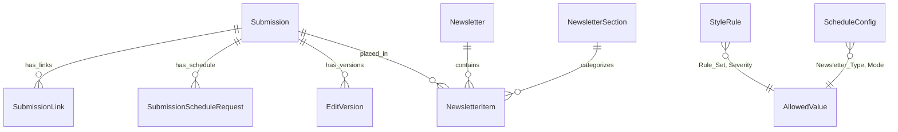

# Communications (UCM Daily Register)

The UCM Daily Register application is an AI-assisted newsletter production pipeline serving the University of Idaho's University Communications and Marketing (UCM) team. It manages the end-to-end workflow for two institutional newsletters: **The Daily Register (TDR)**, distributed to faculty and staff on weekdays, and **My UI**, distributed to students on Mondays. The system accepts content submissions from campus communicators, applies AI-driven editorial refinement guided by database-stored style rules, and assembles final newsletters for distribution. Every editorial change is preserved as an immutable version record, providing a complete audit trail from original submission through AI suggestion to final human-approved copy.

## Key Statistics

| Attribute | Value |
|---|---|
| **Domain** | AI-assisted newsletter production |
| **Repository** | [github.com/ui-insight/UCMDailyRegister](https://github.com/ui-insight/UCMDailyRegister) |
| **Newsletters** | The Daily Register (TDR, weekdays) and My UI (Mondays) |
| **Total Tables** | 10 |
| **AllowedValue Groups** | 9 (37 controlled values) |
| **Auth Model** | None (internal tool, network-restricted) |
| **Stack** | FastAPI + SQLAlchemy 2.0 + React/TypeScript + TailwindCSS |
| **Prod URL** | `ucmnews.insight.uidaho.edu` (port 9280) |
| **Dev URL** | `ucmnews-dev.insight.uidaho.edu` (port 9290) |

## Entity Relationship Diagram

## Table Inventory

### Content Pipeline

| Table | Description |
|---|---|
| `Submission` | A content item submitted by a campus communicator for inclusion in a newsletter. Contains the original text, submitter metadata, and current editorial status. Central entity linking to versions, links, schedule requests, and newsletter placements. |
| `SubmissionLink` | URLs associated with a submission (event links, registration pages, resource links). Stored separately to support multiple links per submission with display-text and ordering. |
| `SubmissionScheduleRequest` | Requested publication dates and newsletter targets for a submission. Communicators can request specific dates and indicate whether content should appear in TDR, My UI, or both. |
| `EditVersion` | Immutable record of a submission's text at a specific editorial stage. Each version has a `Version_Type` indicating its role in the pipeline: `original` (as submitted), `ai_suggested` (LLM-edited), or `editor_final` (human-approved). Creates a complete audit trail of all editorial changes. |

### Newsletter Assembly

| Table | Description |
|---|---|
| `Newsletter` | A specific edition of a newsletter (e.g., "TDR 2026-02-28"). Contains the publication date, newsletter type, and assembly status. Serves as the container for ordered newsletter items. |
| `NewsletterItem` | Junction table placing a submission into a newsletter with a specific section assignment and display order. Links the content pipeline to the assembled newsletter. |
| `NewsletterSection` | Named sections within a newsletter (e.g., "Announcements", "Events", "Deadlines"). Defines the structural template for newsletter assembly with display ordering. |

### Configuration

| Table | Description |
|---|---|
| `StyleRule` | Editorial rules loaded into AI system prompts to guide text transformation. Rules are categorized by `Rule_Set` (e.g., AP_Style, UCM_House) and `Severity` (must, should, prefer). Stored in the database rather than hard-coded to allow non-developer editing. |
| `ScheduleConfig` | Publication schedule configuration defining which newsletter types publish on which days, along with submission deadlines and processing modes. |
| `AllowedValue` | Centralized controlled vocabulary store shared across the application. All picklist values and enum-like fields reference this table. |

## AllowedValue Groups

| Value Group | Example Values | Used By |
|---|---|---|
| `Newsletter_Type` | TDR, My_UI | Newsletter, ScheduleConfig |
| `Submission_Status` | Draft, Submitted, In_Review, Approved, Published, Rejected | Submission |
| `Version_Type` | original, ai_suggested, editor_final | EditVersion |
| `Rule_Set` | AP_Style, UCM_House, Headline, Brevity | StyleRule |
| `Severity` | must, should, prefer | StyleRule |
| `Section_Name` | Announcements, Events, Deadlines, Opportunities | NewsletterSection |
| `Link_Type` | Primary, Registration, Resource, Related | SubmissionLink |
| `Schedule_Mode` | auto, manual, hold | ScheduleConfig |
| `Day_Of_Week` | Monday, Tuesday, Wednesday, Thursday, Friday | ScheduleConfig |

## AI Integration

!!! info "Abstracted LLM Provider Architecture"
    The UCM Daily Register uses an abstracted AI provider layer that supports three backends -- Anthropic Claude, OpenAI, and MindRouter (on-prem) -- switchable at runtime via the `LLM_PROVIDER` environment variable. This design allows the team to evaluate different models without code changes and to fall back to on-premises inference when cloud APIs are unavailable.

The AI editing pipeline operates in a defined sequence:

1. **Pre-analysis:** The submission text is analyzed for structure, length, and content type to determine applicable style rule sets.
2. **Style rule loading:** Relevant `StyleRule` records are loaded from the database and injected into the LLM system prompt, organized by severity level.
3. **LLM prompt construction:** The system prompt (with style rules) and user prompt (with submission text) are assembled and sent to the configured provider.
4. **Structured response:** The LLM returns a structured JSON response containing the edited text, a list of changes made, and confidence scores.
5. **Post-processing:** Headline case rules are applied, diff generation compares original to suggested text, and the result is persisted as an `EditVersion` with `Version_Type = ai_suggested`.

!!! tip "Immutable Edit Trail"
    The `EditVersion` table enforces an append-only pattern. Once an `EditVersion` record is created, it is never modified. The editorial workflow progresses by creating new version records: `original` -> `ai_suggested` -> `editor_final`. This design provides a complete, tamper-evident audit trail suitable for institutional review.

## Deployment

The application follows the standard three-container Docker architecture:

| Container | Role | Port |
|---|---|---|
| `frontend` (nginx) | Serves React build, proxies `/api/` to backend | Host-mapped (9280 prod / 9290 dev) |
| `backend` (uvicorn) | FastAPI application server | 8001 (internal) |
| `db` (postgres:16) | PostgreSQL database | 5432 (internal) |

The frontend Vite dev server proxies `/api` requests to `http://localhost:8001` during local development.
