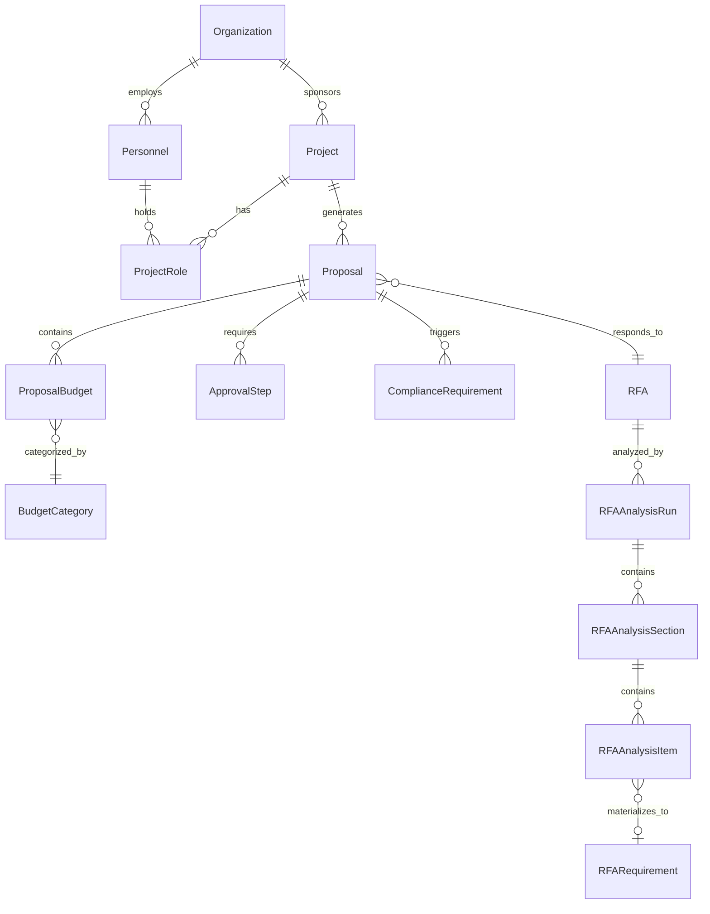

# Research Administration (OpenERA)

OpenERA is the University of Idaho's pre-award proposal management system, built to streamline the full lifecycle of sponsored-project proposals from initial routing through compliance review and institutional approval. It is the **reference implementation** of the AI4RA-UDM (AI for Research Administration -- Unified Data Model) specification, meaning every domain table in the UDM maps directly to a SQLAlchemy model in this application. OpenERA serves the Office of Sponsored Programs, department administrators, and principal investigators, providing role-based workflows that mirror the university's existing routing and approval processes while adding AI-assisted document review and compliance checking.

## Key Statistics

| Attribute | Value |
|---|---|
| **Domain** | Pre-award proposal management |
| **Repository** | [github.com/ui-insight/OpenERA](https://github.com/ui-insight/OpenERA) |
| **Data Model Spec** | AI4RA-UDM (direct implementation) |
| **Total Tables** | 32 |
| **AllowedValue Groups** | 21 (142 controlled values) |
| **Check-Constrained Enums** | 6 (Internal_Approval_Status, Decision_Status, Analysis_Type, Analysis_Status, Section_Type, Item_Type) |
| **Auth Model** | JWT with 5 RBAC roles |
| **Stack** | FastAPI + SQLAlchemy 2.0 + React/TypeScript + TailwindCSS |
| **Prod URL** | `openera.insight.uidaho.edu` (port 9200) |
| **Dev URL** | `openera-dev.insight.uidaho.edu` (port 9210) |

## Entity Relationship Diagram

## Table Inventory

### Core Entities

| Table | Description |
|---|---|
| `Organization` | Sponsors, sub-recipients, and institutional units involved in funded research. Supports hierarchical relationships for multi-org collaborations. |
| `Personnel` | Faculty, staff, and external collaborators who participate in proposals and projects. Links to contact details and compliance records. |
| `ContactDetails` | Structured contact information (address, phone, email) associated with personnel records. Separated to support multiple contact types per person. |
| `Project` | Funded research projects that serve as the parent container for one or more proposals. Tracks lifecycle from inception through closeout. |
| `Proposal` | A specific submission to a funding agency, linked to a project and optionally to a Request for Applications. Central entity in the pre-award workflow. |

### Pre-Award

| Table | Description |
|---|---|
| `ProposalBudget` | Line-item budget entries for a proposal, categorized by budget category and linked to indirect rate calculations. |
| `BudgetCategory` | Controlled list of budget line-item types (e.g., personnel, equipment, travel, participant support). Referenced by budget entries. |
| `IndirectRate` | Facilities and Administrative (F&A) rate records applicable to proposals, supporting multiple rate agreements and effective date ranges. |
| `ProjectRole` | Junction table assigning personnel to projects with specific roles (PI, Co-PI, Senior Personnel, etc.) and effort percentages. |
| `RFA` | Request for Applications / Funding Opportunity Announcements that proposals respond to. Captures sponsor requirements and deadlines. |
| `RFARequirement` | Specific requirements extracted from an RFA (page limits, formatting rules, required sections) used for compliance checking. |

### Compliance

| Table | Description |
|---|---|
| `ComplianceRequirement` | Regulatory and institutional compliance obligations triggered by proposal characteristics (human subjects, animal use, export control, etc.). |
| `ConflictOfInterest` | Disclosed financial or personal conflicts of interest for personnel on a proposal, with management plans and review status. |
| `SponsorCompliancePolicy` | Sponsor-specific compliance policies that apply to proposals submitted to a given funding agency. |
| `PersonnelComplianceRecord` | Individual compliance training, certifications, and clearance records for personnel (CITI training, RCR, etc.). |
| `SponsorEligibilityRule` | Rules defining who is eligible to submit to a particular sponsor or program (institution type, PI qualifications, etc.). |
| `EligibilityOverride` | Documented exceptions to sponsor eligibility rules, with justification and approver information. |

### Documents

| Table | Description |
|---|---|
| `Document` | Uploaded files (narrative sections, budgets, support letters) associated with proposals, with versioning and review status. |
| `DocumentReviewFinding` | AI-generated or human-entered findings from document review (formatting issues, missing sections, compliance flags). |
| `PersonnelReviewFinding` | Findings specific to personnel documents (biosketches, current-and-pending, COI disclosures). |

### Workflow

| Table | Description |
|---|---|
| `ApprovalStep` | Sequential approval routing steps for a proposal (department chair, dean, OSP reviewer), with status tracking and timestamps. |
| `ProposalChecklistItem` | Pre-submission checklist items that must be completed before a proposal can advance to the next approval step. |

### RFA Analysis

| Table | Description |
|---|---|
| `RFAAnalysisRun` | An AI analysis execution against an RFA document. Tracks provenance (analysis type, model, prompt version) and supports cross-replication evaluation. The `Is_Current` flag marks the active source of truth per (RFA_ID, Analysis_Type) pair. |
| `RFAAnalysisSection` | A structural section within an analysis run (e.g., "Dates & Deadlines", "Eligibility", "Budget Requirements"). Each section has a `Section_Type` discriminator controlling how its items are structured. |
| `RFAAnalysisItem` | An individual extracted fact, rule, or key-value pair within a section. Supports typed parsing into `Parsed_Date`, `Parsed_Number`, or `Parsed_Boolean` for downstream compliance queries. Optional FK to `RFARequirement` provides traceability from raw extraction to normalized checklist items. |

### AI

| Table | Description |
|---|---|
| `LLMEndpoint` | Configured LLM service endpoints (model name, base URL, API key reference, temperature, token limits). Supports multiple providers. |
| `AIWorkflowMapping` | Maps specific AI tasks (document review, compliance check, budget analysis) to LLM endpoints, enabling per-task model assignment. |

### System

| Table | Description |
|---|---|
| `User` | Application user accounts with role assignments and authentication credentials. |
| `DataDictionary` | Self-documenting metadata for all tables and columns in the data model, queryable at runtime. |
| `ActivityLog` | Timestamped audit trail of user actions across the application (creates, updates, approvals, AI invocations). |
| `AllowedValue` | Centralized controlled vocabulary store. All enums and picklist values are stored here rather than hard-coded. |
| `Token_Blacklist` | Revoked JWT identifiers for persistent token invalidation across server restarts. Stores JTI, expiration, and blacklist timestamp. |

## AllowedValue Groups

The `AllowedValue` table stores all controlled vocabularies for the application. Values are grouped by `Allowed_Value_Group` and referenced by foreign key throughout the data model. All codes use `snake_case` naming.

| Value Group | Codes | Count | Used By |
|---|---|---|---|
| `DocumentType` | `proposal_narrative`, `budget_justification`, `biosketch`, `current_pending`, `facilities`, `data_mgmt`, `letter_support`, `rfa_document`, `subaward_docs`, `coi_disclosure`, `other` | 11 | Document |
| `ProjectRole` | `pi`, `co_pi`, `co_i`, `key_person`, `senior_person`, `postdoc`, `grad_student`, `undergrad`, `technician`, `consultant` | 10 | ProjectRole |
| `ProjectType` | `research`, `instruction`, `public_service`, `fellowship`, `equipment`, `conference`, `other` | 7 | Project |
| `ContactType` | `email`, `phone`, `fax`, `address` | 4 | ContactDetails |
| `COIRelationship` | `equity`, `consulting`, `board`, `ip`, `travel`, `other` | 6 | ConflictOfInterest |
| `FundType` | `sponsored`, `institutional`, `cost_share` | 3 | ProposalBudget |
| `TransactionType` | `expenditure`, `encumbrance`, `revenue`, `transfer` | 4 | (post-award, reserved) |
| `DeliverableType` | `progress_report`, `final_report`, `financial_report`, `invention_report`, `other` | 5 | (post-award, reserved) |
| `ModEventType` | `no_cost_ext`, `supplemental`, `budget_realloc`, `pi_change`, `scope_change`, `reduction`, `termination` | 7 | (post-award, reserved) |
| `ProposalCategory` | `full`, `preliminary`, `subproject` | 3 | Proposal |
| `ProposalActionType` | `new`, `renewal`, `continuation`, `supplement`, `revision`, `resubmission`, `transfer_in` | 7 | Proposal |
| `AgreementType` | `grant`, `cooperative`, `contract`, `subaward`, `other` | 5 | Proposal |
| `CampusType` | `on_campus`, `off_campus`, `ag_research`, `ag_non_research` | 4 | Proposal |
| `CampusLocation` | `moscow`, `boise`, `cda`, `if`, `tf` | 5 | Proposal |
| `SponsorRegulatory` | `dod`, `nist_sp800`, `cmmc`, `cui`, `doe`, `nasa`, `nih`, `nsf` | 8 | Proposal |
| `ExportControl` | `foreign_involvement`, `military_defense`, `pub_restrictions`, `foreign_national_id`, `work_outside_us`, `intl_travel`, `controlled_tech`, `uas_drone` | 8 | Proposal |
| `ResearchInstitute` | `iids`, `imci`, `ari`, `iwrri`, `igs`, `caes`, `ihhe`, `ics`, `na` | 9 | Proposal |
| `RequirementCategory` | `document`, `formatting`, `eligibility`, `review_criterion`, `budget_constraint`, `submission`, `deadline`, `compliance` | 8 | RFARequirement |
| `ChecklistStatus` | `not_started`, `in_progress`, `complete`, `not_applicable` | 4 | ProposalChecklistItem |
| `AppointmentType` | `tenured`, `tenure_track`, `non_tenure_track`, `research_faculty`, `extension_faculty`, `librarian_faculty`, `clinical_faculty`, `visiting_faculty`, `emeritus`, `postdoctoral_fellow`, `research_scientist`, `staff`, `graduate_student`, `undergraduate_student`, `external_collaborator` | 15 | Personnel |
| `FacultyRank` | `professor`, `assoc_professor`, `asst_professor`, `lecturer`, `senior_lecturer`, `clinical_professor`, `research_sci_i`, `research_sci_ii`, `research_sci_iii` | 9 | Personnel |

## Check-Constrained Enums (RFA Analysis)

The RFA Analysis tables use SQL CHECK constraints rather than the AllowedValue pattern for their categorical columns. These values are enforced at the database level.

| Column | Table | Values |
|---|---|---|
| `Internal_Approval_Status` | Proposal | `Draft`, `In Review`, `Approved`, `Rejected`, `Returned` |
| `Decision_Status` | Proposal | `Pending`, `Awarded`, `Declined`, `Withdrawn` |
| `Analysis_Type` | RFAAnalysisRun | `comprehensive_checklist`, `ffr_checklist`, `eligibility_review`, `budget_review`, `custom` |
| `Status` | RFAAnalysisRun | `pending`, `completed`, `failed`, `superseded` |
| `Section_Type` | RFAAnalysisSection | `key_value`, `table`, `rule_list`, `narrative`, `mixed` |
| `Item_Type` | RFAAnalysisItem | `text`, `date`, `currency`, `integer`, `boolean`, `duration`, `rule` |

## AI Integration

!!! info "Configurable Multi-Endpoint LLM Architecture"
    OpenERA uses a configurable AI architecture where multiple LLM endpoints can be registered in the `LLMEndpoint` table and then mapped to specific workflow tasks via `AIWorkflowMapping`. This allows administrators to assign different models to different tasks (e.g., a specialized model for compliance checking vs. a general model for narrative review) without code changes.

Key AI capabilities:

- **Document Review:** Automated review of proposal narratives against RFA requirements and formatting rules, producing structured findings.
- **Compliance Checking:** Analysis of proposal characteristics to identify triggered compliance requirements (IRB, IACUC, export control).
- **Budget Analysis:** Validation of budget entries against sponsor guidelines and institutional rate agreements.
- **Personnel Review:** Biosketch and current-and-pending document review for completeness and formatting compliance.

## Authentication and Authorization

!!! note "Role-Based Access Control"
    OpenERA implements JWT-based authentication with five hierarchical roles controlling access to proposals, approvals, and administrative functions.

| Role | Permissions |
|---|---|
| `system_admin` | Full system access, user management, LLM endpoint configuration |
| `osp_admin` | Review and approve proposals at OSP level, manage compliance, view all submissions |
| `college_admin` | Review and approve proposals at college level |
| `dept_admin` | Route proposals within department, manage department personnel |
| `pi` | Create and edit own proposals, view project team, submit for routing |

## Deployment

OpenERA runs as a two-container stack (frontend + backend) connected to the shared [insight-db](https://github.com/ui-insight/insight-db) PostgreSQL instance via the `insight-db-net` Docker network:

| Container | Role | Port |
|---|---|---|
| `frontend` (nginx) | Serves React build, proxies `/api/` to backend | Host-mapped (9200 prod / 9210 dev) |
| `backend` (uvicorn) | FastAPI application server, connects to `insight-db` | 8000 (internal) |
| `insight-db` (shared) | Shared PostgreSQL 16 instance | 5432 (internal, `insight-db-net`) |

!!! warning "Reference Implementation Status"
    OpenERA is the only application in the UI Insight portfolio that directly implements the AI4RA-UDM domain tables. All other applications share architectural conventions (AllowedValue pattern, PascalCase column naming, service-layer design) but define their own domain-specific tables. Changes to the UDM specification should be validated against OpenERA first.
