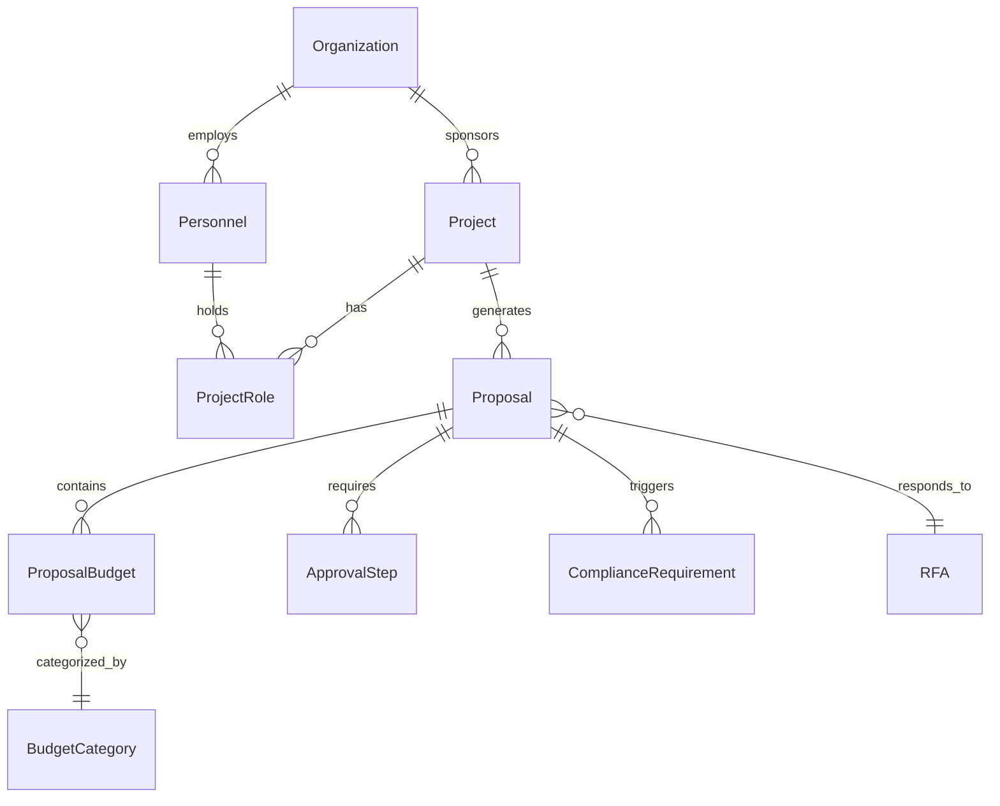

# Research Administration (OpenERA)

OpenERA is the University of Idaho's pre-award proposal management system, built to streamline the full lifecycle of sponsored-project proposals from initial routing through compliance review and institutional approval. It is the **reference implementation** of the AI4RA-UDM (AI for Research Administration -- Unified Data Model) specification, meaning every domain table in the UDM maps directly to a SQLAlchemy model in this application. OpenERA serves the Office of Sponsored Programs, department administrators, and principal investigators, providing role-based workflows that mirror the university's existing routing and approval processes while adding AI-assisted document review and compliance checking.

## Key Statistics

| Attribute | Value |
|---|---|
| **Domain** | Pre-award proposal management |
| **Repository** | [github.com/ui-insight/OpenERA](https://github.com/ui-insight/OpenERA) |
| **Data Model Spec** | AI4RA-UDM (direct implementation) |
| **Total Tables** | 28 |
| **AllowedValue Groups** | 10 (72+ controlled values) |
| **Auth Model** | JWT with 5 RBAC roles |
| **Stack** | FastAPI + SQLAlchemy 2.0 + React/TypeScript + TailwindCSS |
| **Prod URL** | `openera.insight.uidaho.edu` (port 9200) |
| **Dev URL** | `openera-dev.insight.uidaho.edu` (port 9210) |

## Entity Relationship Diagram

## Table Inventory

### Core Entities

| Table | Description |
|---|---|
| `Organization` | Sponsors, sub-recipients, and institutional units involved in funded research. Supports hierarchical relationships for multi-org collaborations. |
| `Personnel` | Faculty, staff, and external collaborators who participate in proposals and projects. Links to contact details and compliance records. |
| `ContactDetails` | Structured contact information (address, phone, email) associated with personnel records. Separated to support multiple contact types per person. |
| `Project` | Funded research projects that serve as the parent container for one or more proposals. Tracks lifecycle from inception through closeout. |
| `Proposal` | A specific submission to a funding agency, linked to a project and optionally to a Request for Applications. Central entity in the pre-award workflow. |

### Pre-Award

| Table | Description |
|---|---|
| `ProposalBudget` | Line-item budget entries for a proposal, categorized by budget category and linked to indirect rate calculations. |
| `BudgetCategory` | Controlled list of budget line-item types (e.g., personnel, equipment, travel, participant support). Referenced by budget entries. |
| `IndirectRate` | Facilities and Administrative (F&A) rate records applicable to proposals, supporting multiple rate agreements and effective date ranges. |
| `ProjectRole` | Junction table assigning personnel to projects with specific roles (PI, Co-PI, Senior Personnel, etc.) and effort percentages. |
| `RFA` | Request for Applications / Funding Opportunity Announcements that proposals respond to. Captures sponsor requirements and deadlines. |
| `RFARequirement` | Specific requirements extracted from an RFA (page limits, formatting rules, required sections) used for compliance checking. |

### Compliance

| Table | Description |
|---|---|
| `ComplianceRequirement` | Regulatory and institutional compliance obligations triggered by proposal characteristics (human subjects, animal use, export control, etc.). |
| `ConflictOfInterest` | Disclosed financial or personal conflicts of interest for personnel on a proposal, with management plans and review status. |
| `SponsorCompliancePolicy` | Sponsor-specific compliance policies that apply to proposals submitted to a given funding agency. |
| `PersonnelComplianceRecord` | Individual compliance training, certifications, and clearance records for personnel (CITI training, RCR, etc.). |
| `SponsorEligibilityRule` | Rules defining who is eligible to submit to a particular sponsor or program (institution type, PI qualifications, etc.). |
| `EligibilityOverride` | Documented exceptions to sponsor eligibility rules, with justification and approver information. |

### Documents

| Table | Description |
|---|---|
| `Document` | Uploaded files (narrative sections, budgets, support letters) associated with proposals, with versioning and review status. |
| `DocumentReviewFinding` | AI-generated or human-entered findings from document review (formatting issues, missing sections, compliance flags). |
| `PersonnelReviewFinding` | Findings specific to personnel documents (biosketches, current-and-pending, COI disclosures). |

### Workflow

| Table | Description |
|---|---|
| `ApprovalStep` | Sequential approval routing steps for a proposal (department chair, dean, OSP reviewer), with status tracking and timestamps. |
| `ProposalChecklistItem` | Pre-submission checklist items that must be completed before a proposal can advance to the next approval step. |

### AI

| Table | Description |
|---|---|
| `LLMEndpoint` | Configured LLM service endpoints (model name, base URL, API key reference, temperature, token limits). Supports multiple providers. |
| `AIWorkflowMapping` | Maps specific AI tasks (document review, compliance check, budget analysis) to LLM endpoints, enabling per-task model assignment. |

### System

| Table | Description |
|---|---|
| `User` | Application user accounts with role assignments and authentication credentials. |
| `DataDictionary` | Self-documenting metadata for all tables and columns in the data model, queryable at runtime. |
| `ActivityLog` | Timestamped audit trail of user actions across the application (creates, updates, approvals, AI invocations). |
| `AllowedValue` | Centralized controlled vocabulary store. All enums and picklist values are stored here rather than hard-coded. |

## AllowedValue Groups

The `AllowedValue` table stores all controlled vocabularies for the application. Values are grouped by `Value_Group` and referenced by foreign key throughout the data model.

| Value Group | Example Values | Used By |
|---|---|---|
| `Proposal_Status` | Draft, Routing, Under_Review, Submitted, Awarded, Declined | Proposal |
| `Budget_Category` | Personnel, Equipment, Travel, Participant_Support, Other_Direct | BudgetCategory |
| `Compliance_Type` | IRB, IACUC, IBC, Export_Control, RCR | ComplianceRequirement |
| `COI_Status` | No_Conflict, Disclosed, Under_Review, Managed | ConflictOfInterest |
| `Approval_Status` | Pending, Approved, Returned, Withdrawn | ApprovalStep |
| `Document_Type` | Narrative, Budget_Justification, Biosketch, Support_Letter | Document |
| `Finding_Severity` | Info, Warning, Error | DocumentReviewFinding |
| `Project_Role` | PI, Co_PI, Senior_Personnel, Postdoc, Student | ProjectRole |
| `Organization_Type` | Federal, State, Foundation, Industry, Academic | Organization |
| `Eligibility_Status` | Eligible, Ineligible, Override_Granted | SponsorEligibilityRule |

## AI Integration

!!! info "Configurable Multi-Endpoint LLM Architecture"
    OpenERA uses a configurable AI architecture where multiple LLM endpoints can be registered in the `LLMEndpoint` table and then mapped to specific workflow tasks via `AIWorkflowMapping`. This allows administrators to assign different models to different tasks (e.g., a specialized model for compliance checking vs. a general model for narrative review) without code changes.

Key AI capabilities:

- **Document Review:** Automated review of proposal narratives against RFA requirements and formatting rules, producing structured findings.
- **Compliance Checking:** Analysis of proposal characteristics to identify triggered compliance requirements (IRB, IACUC, export control).
- **Budget Analysis:** Validation of budget entries against sponsor guidelines and institutional rate agreements.
- **Personnel Review:** Biosketch and current-and-pending document review for completeness and formatting compliance.

## Authentication and Authorization

!!! note "Role-Based Access Control"
    OpenERA implements JWT-based authentication with five hierarchical roles controlling access to proposals, approvals, and administrative functions.

| Role | Permissions |
|---|---|
| `admin` | Full system access, user management, LLM endpoint configuration |
| `osp_reviewer` | Review and approve proposals, manage compliance, view all submissions |
| `department_admin` | Route proposals within department, manage department personnel |
| `pi` | Create and edit own proposals, view project team, submit for routing |
| `viewer` | Read-only access to assigned proposals and projects |

## Deployment

OpenERA follows the standard three-container Docker architecture used across the UI Insight platform:

| Container | Role | Port |
|---|---|---|
| `frontend` (nginx) | Serves React build, proxies `/api/` to backend | Host-mapped (9200 prod / 9210 dev) |
| `backend` (uvicorn) | FastAPI application server | 8001 (internal) |
| `db` (postgres:16) | PostgreSQL database | 5432 (internal) |

!!! warning "Reference Implementation Status"
    OpenERA is the only application in the UI Insight portfolio that directly implements the AI4RA-UDM domain tables. All other applications share architectural conventions (AllowedValue pattern, PascalCase column naming, service-layer design) but define their own domain-specific tables. Changes to the UDM specification should be validated against OpenERA first.
