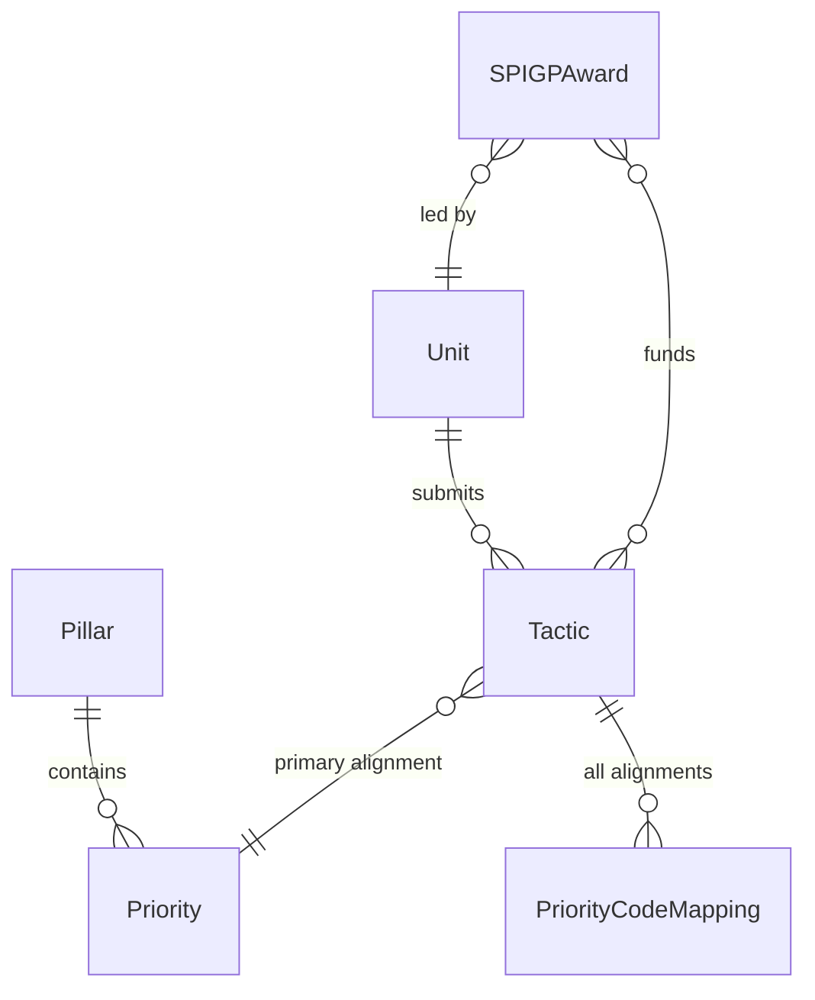

# Strategic Planning (StratPlan Tactics Dashboard)

The StratPlan Tactics Dashboard is a read-only analytics application that visualizes tactical alignment data for the University of Idaho's 2025-2030 Strategic Plan. It enables leadership and planning staff to explore how unit-level tactics map to institutional priorities and pillars, identify gaps in strategic coverage, and track funding through SPIGP (Strategic Plan Implementation Grant Program) awards. Unlike the other applications in the UI Insight portfolio, this dashboard has no database layer -- all data is served from static JSON files, and the frontend is built with plain React/JSX and custom CSS rather than TypeScript and TailwindCSS.

## Key Statistics

| Attribute | Value |
|---|---|
| **Domain** | Strategic plan alignment analytics |
| **Repository** | [github.com/ui-insight/StratPlanTacticsMB](https://github.com/ui-insight/StratPlanTacticsMB) |
| **Strategic Plan** | University of Idaho 2025-2030 |
| **Implicit Entities** | 6 (no database tables) |
| **Data Source** | Static JSON files |
| **Auth Model** | None |
| **Stack** | React + JSX + Custom CSS (divergent from sibling apps) |
| **AI Integration** | None |
| **Prod URL** | Port 9220 |
| **Dev URL** | Port 9230 |

## Entity Relationship Diagram

## Entity Inventory

!!! note "JSON-Backed Entities"
    The following entities are not backed by database tables. They are defined implicitly by the structure of the static JSON data files loaded at application startup. Field names follow PascalCase conventions consistent with the UDM specification.

### Strategic Framework

| Entity | Count | Description |
|---|---|---|
| `Pillar` | 5 | Top-level strategic themes of the 2025-2030 plan (e.g., student success, research excellence, community engagement). Each pillar contains multiple priorities. |
| `Priority` | 20 | Specific strategic objectives nested under pillars. Priorities define measurable goals and serve as the alignment targets for unit-level tactics. |

### Tactical Alignment

| Entity | Count | Description |
|---|---|---|
| `Unit` | 25 | Academic and administrative units that submit tactics aligned to strategic priorities. Each unit may submit multiple tactics across different priorities. |
| `Tactic` | 385 | A specific action or initiative submitted by a unit, aligned to a primary strategic priority. Tactics describe what the unit will do to advance the strategic plan. |
| `PriorityCodeMapping` | -- | Junction records mapping a tactic to all strategic priorities it addresses (primary and secondary). A single tactic may align to multiple priorities across different pillars. |

### Funding

| Entity | Count | Description |
|---|---|---|
| `SPIGPAward` | 3 | Strategic Plan Implementation Grant Program awards that fund specific tactics. Each award is led by a unit and may support one or more tactics. Tracks award amount and funded period. |

## Data Architecture

!!! warning "No Database Layer"
    This application currently has no SQLAlchemy models, no migrations, and no AllowedValue table. All data is read from JSON files bundled with the frontend build. If the application evolves to include write operations (e.g., tactic status tracking, progress reporting, investment portfolio management), it should adopt the full AllowedValue + SQLAlchemy pattern used by sibling applications.

The data flow is straightforward:

1. Strategic plan data is curated offline and exported as JSON files.
2. JSON files are placed in the frontend source tree and bundled at build time.
3. The React application loads JSON data at startup and renders interactive visualizations.
4. There is no backend API -- the application is entirely client-side.

## AI Integration

This application does not currently include any AI integration. Potential future AI capabilities could include:

- Automated gap analysis identifying strategic priorities with insufficient tactical coverage.
- Natural language search across tactics to find thematic clusters.
- Progress narrative generation from tactic status data (if write operations are added).

## Technology Divergence

!!! abstract "Stack Differences from Sibling Applications"
    The StratPlan Tactics Dashboard explicitly diverges from the standard UI Insight technology stack. This table summarizes the differences for governance reviewers.

| Aspect | Sibling Apps (Standard) | StratPlan Dashboard |
|---|---|---|
| **Language** | TypeScript | JavaScript (JSX) |
| **Styling** | TailwindCSS | Custom CSS |
| **Backend** | FastAPI + SQLAlchemy | None |
| **Database** | PostgreSQL | Static JSON |
| **AI** | LLM provider abstraction | None |
| **Auth** | JWT + RBAC roles | None |
| **AllowedValue pattern** | Yes | No |

The application follows UDM conventions in spirit -- PascalCase field naming is used in the JSON data files -- but does not have the infrastructure to enforce controlled vocabularies or audit trails.

## Deployment

Because there is no backend or database, the deployment architecture is simpler than sibling applications:

| Container | Role | Port |
|---|---|---|
| `frontend` (nginx) | Serves the React build as static files | Host-mapped (9220 prod / 9230 dev) |

No backend or database containers are required. The nginx container serves the built React application directly.

## Evolution Path

The StratPlan Tactics Dashboard is positioned to evolve toward a strategic execution and investment portfolio tracking system. If this evolution proceeds, the following architectural changes would be expected:

1. **Add a FastAPI backend** with SQLAlchemy models mirroring the current JSON entities.
2. **Introduce the AllowedValue table** for controlled vocabularies (tactic status, funding categories, reporting periods).
3. **Migrate from JSX to TypeScript** and from custom CSS to TailwindCSS for consistency with the portfolio.
4. **Add authentication** with appropriate RBAC roles for unit reporters, planning staff, and leadership viewers.
5. **Introduce AI capabilities** for gap analysis and progress narrative generation.
