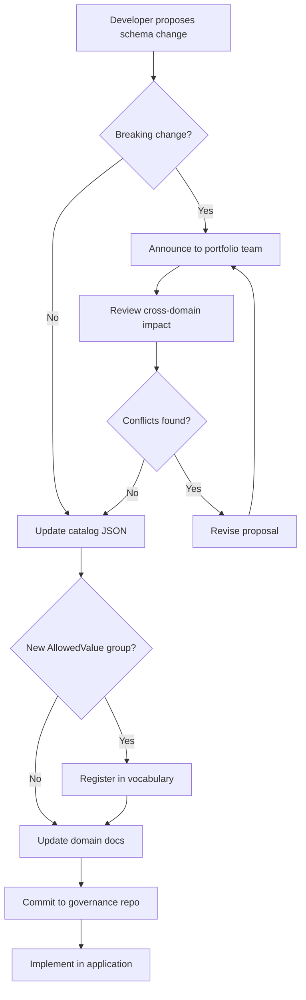

# Review Process

This page describes how data model changes are reviewed across the UI Insight portfolio. The process is intentionally lightweight -- it provides enough structure to catch cross-domain conflicts and maintain registry accuracy without creating bureaucratic overhead.

!!! info "Living document"
    This review process is a starting point. It will be refined as the institutional data governance practice matures and as the portfolio grows beyond its current six applications.

## What Requires Review

### Schema Changes

Any change to the data model of an application should be documented and reviewed:

| Change Type | Action Required |
|---|---|
| New table | Add to catalog JSON; update domain documentation page |
| New column on existing table | Update catalog JSON entry for the table |
| Column rename | Update catalog JSON; check for downstream consumers |
| Column type change | Update catalog JSON; verify no data loss |
| Table drop | Remove from catalog JSON; verify no cross-references |
| New relationship (FK) | Update catalog JSON with relationship metadata |

### Vocabulary Changes

Changes to AllowedValue groups follow the process described in the [Extension Protocol](extension-protocol.md):

| Change Type | Action Required |
|---|---|
| New AllowedValue group | Register in vocabulary JSON; update [Vocabularies by Domain](../vocabulary/by-domain.md) |
| New code in existing group | Update vocabulary JSON and domain listing |
| Code rename or removal | Review for downstream impact; update all registry references |
| Group deprecation | Mark as deprecated in registry; do not remove until all references are cleared |

### Breaking Changes

The following changes are considered **breaking** and require explicit review before implementation:

- Column renames on tables referenced by other applications or reporting systems
- Table drops or restructuring
- AllowedValue code renames (downstream systems may store the old code value)
- Changes to API response schemas that external consumers depend on

!!! warning "Breaking change review"
    Breaking changes should be announced to the portfolio team before implementation. Check the [Shared Patterns](../vocabulary/shared-patterns.md) registry to identify whether other applications use similar vocabulary concepts that could be affected.

## Review Checklist

When preparing a data model change for review, verify the following:

- [ ] **Naming conventions** -- New columns follow `PascalCase_With_Underscores`; new AllowedValue codes use `snake_case`
- [ ] **Catalog updated** -- The catalog JSON in this governance repository reflects the new or modified schema
- [ ] **Vocabulary registered** -- Any new AllowedValue groups are documented in the vocabulary registry
- [ ] **Cross-domain check** -- The change does not conflict with or duplicate patterns in other applications (consult [Shared Patterns](../vocabulary/shared-patterns.md))
- [ ] **Seed data current** -- The application's `backend/data/` seed files include any new AllowedValues
- [ ] **Documentation updated** -- The domain documentation page reflects the change

## Process Flow

## Who Reviews

Currently, data model changes are reviewed informally by the portfolio development team. As the governance practice matures, formal review roles may be established:

- **Domain steward** -- The primary developer or product owner for each application domain
- **Data architect** -- Responsible for cross-domain consistency and naming convention adherence
- **Vocabulary curator** -- Maintains the AllowedValue registry and shared patterns documentation

!!! tip "Lightweight governance"
    The goal is to catch conflicts and maintain documentation accuracy, not to create approval bottlenecks. Most changes can be self-reviewed using the checklist above. Formal review is reserved for breaking changes and new cross-domain patterns.
