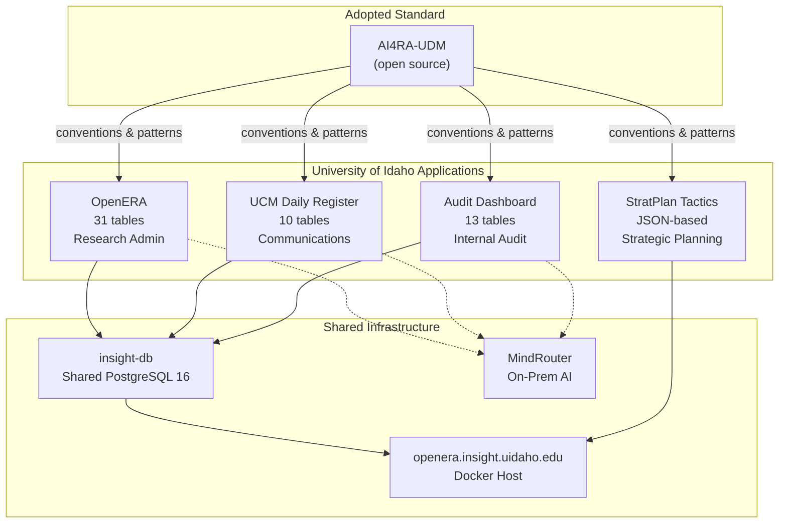

# UI Insight Data Governance

## Institutional Data Standard for the University of Idaho

The UI Insight application portfolio is a family of purpose-built applications serving University of Idaho administrative functions. All applications share a common data modeling standard, controlled vocabulary pattern, and deployment infrastructure.

This documentation provides a unified view of the institutional data landscape for governance reviewers, developers, and stakeholders.

## Adopted Standard

Our data modeling conventions are adopted from the [AI4RA Unified Data Model](https://github.com/ui-insight/AI4RA-UDM), an open-source specification for research administration. While the UDM's domain scope is research administration, its naming conventions, design patterns, and controlled vocabulary approach serve as our institutional standard across all domains.

**Key conventions adopted:**

- `PascalCase_With_Underscores` column naming with standard suffixes (`_ID`, `_Date`, `_Status`, `_Type`)
- The [`AllowedValue` pattern](standard/allowed-values.md) for database-driven controlled vocabularies
- Service layer separation, async-first ORM, and immutable audit records
- Consistent tech stack: FastAPI + SQLAlchemy + React + MkDocs Material

See [Adopted Standard](standard/naming-conventions.md) for full details.

## Application Portfolio

| Application | Domain | Data Model | AI Integration |
|---|---|---|---|
| [OpenERA](domains/research-admin.md) | Research Administration | 31 tables (implements AI4RA-UDM) | Multi-endpoint configurable |
| [UCM Daily Register](domains/communications.md) | Communications | 10 tables | Claude / OpenAI / MindRouter |
| [Audit Dashboard](domains/audit.md) | Internal Audit | 13 tables | MindRouter OCR + LLM |
| [StratPlan Tactics](domains/strategic-planning.md) | Strategic Planning | JSON-based (6 entities) | None |

All database-backed applications share 27 AllowedValue groups totaling 139+ controlled vocabulary values. See the [Vocabulary Registry](vocabulary/index.md) for the complete cross-application view.

## Data Landscape

## For Governance Reviewers

If you are reviewing this portfolio for institutional data governance alignment, start here:

1. **[Naming Conventions](standard/naming-conventions.md)** -- The column naming standard adopted from AI4RA-UDM
2. **[AllowedValue Pattern](standard/allowed-values.md)** -- How we manage controlled vocabularies without hard-coded enums
3. **[Vocabulary Registry](vocabulary/index.md)** -- All categorical values across all applications
4. **[Extension Protocol](governance/extension-protocol.md)** -- How new applications and domains are added to the portfolio
5. **[Review Process](governance/review-process.md)** -- How data model changes are vetted

## Repository Contents

| Directory | Purpose |
|---|---|
| `docs/standard/` | Adopted conventions from AI4RA-UDM |
| `docs/domains/` | Per-application data model documentation |
| `docs/vocabulary/` | Cross-app AllowedValue landscape |
| `docs/portfolio/` | Infrastructure, deployment, AI services |
| `docs/governance/` | Extension protocol and review process |
| `catalog/` | Machine-readable model catalogs (JSON) |
| `vocabularies/` | Federated AllowedValue seed data (JSON) |
