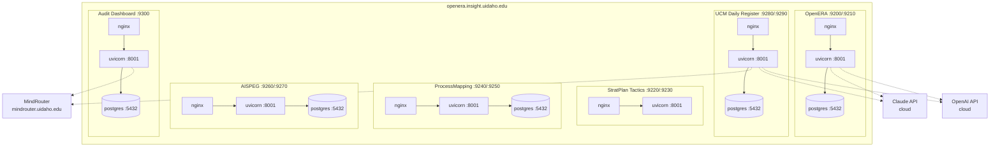

# Architecture

All applications in the UI Insight portfolio share a single deployment server and a common container architecture. This page documents the shared infrastructure, networking, and port allocation scheme.

## Deployment Server

All applications are deployed to a single server managed by the UI Insight team:

| Property | Value |
|---|---|
| Host | `devops@openera.insight.uidaho.edu` |
| Network | University of Idaho campus network |
| Container runtime | Docker + Docker Compose |
| Subnet | Custom `10.x.x.x` address space |

!!! warning "Custom subnet"
    All Docker Compose stacks use a `10.x.x.x` address space rather than Docker's default `172.x.x.x` range. This avoids IP address conflicts on the shared deployment server where multiple Compose stacks run simultaneously.

## Container Pattern

Every database-backed application follows the same three-container architecture:

```
frontend (nginx)  <-- only container with host port mapping
    | proxies /api/
    v
backend (uvicorn) <-- internal only, port 8001
    |
    v
db (postgres:16)  <-- internal only, port 5432
```

- **frontend** -- Serves the production React build via nginx. Proxies all `/api/` requests to the backend container. This is the only container with a port mapped to the host.
- **backend** -- Runs the FastAPI application via uvicorn on port 8001. Accessible only within the Docker network.
- **db** -- PostgreSQL 16 instance. Accessible only within the Docker network on port 5432. Each application has its own isolated database container.

!!! note "StratPlan Tactics exception"
    StratPlan Tactics does not use a database container. It runs as a two-container stack (frontend + backend) with data stored in JSON files mounted as volumes.

## Port Allocations

Each application is assigned a dedicated prod/dev port pair on the host. Ports are allocated in increments of 20, with dev ports offset by 10 from their prod counterpart.

| Application | Prod Port | Dev Port | URL |
|---|---|---|---|
| OpenERA | 9200 | 9210 | openera.insight.uidaho.edu |
| StratPlan Tactics | 9220 | 9230 | stratplan.insight.uidaho.edu |
| ProcessMapping | 9240 | 9250 | processmap.insight.uidaho.edu |
| AISPEG | 9260 | 9270 | aispeg.insight.uidaho.edu |
| UCM Daily Register | 9280 | 9290 | ucmnews.insight.uidaho.edu |
| Audit Dashboard | 9300 | -- | audit.insight.uidaho.edu |

!!! tip "Requesting a new port"
    New applications should request the next available port pair from the deployment administrator. The next available prod port is **9320** (dev: 9330). See the [Extension Protocol](../governance/extension-protocol.md) for the full onboarding process.

## AI Services

Applications that integrate AI capabilities connect to one or more LLM providers through an abstract provider interface:

| Provider | Endpoint | Use Cases | Applications |
|---|---|---|---|
| MindRouter | `mindrouter.uidaho.edu` | On-prem LLM inference, OCR | UCM Daily Register, Audit Dashboard |
| Claude (Anthropic) | Cloud API | Text editing, structured extraction | UCM Daily Register, OpenERA |
| OpenAI | Cloud API | Text editing, embeddings | UCM Daily Register, OpenERA |

The active provider is selected at startup via the `LLM_PROVIDER` environment variable. All providers implement the same `LLMProvider` abstract base class, so switching providers requires no code changes.

MindRouter is the University of Idaho's on-premises AI gateway, providing LLM inference and OCR capabilities without sending data to external cloud services. It is the preferred provider for workloads involving sensitive institutional data.

## Architecture Diagram



## Deploy Command Pattern

All applications follow the same deployment command pattern:

```bash
# On the remote server
HOST_PORT=<PORT> POSTGRES_PASSWORD=<secure> ANTHROPIC_API_KEY=<key> \
  docker compose up -d --build
```

The `HOST_PORT` variable controls which host port the frontend nginx container binds to. All other container ports are internal to the Docker network and do not vary between applications.

## Environment Variables

Each application requires a subset of the following environment variables:

| Variable | Required By | Purpose |
|---|---|---|
| `HOST_PORT` | All | Host port for the frontend nginx container |
| `POSTGRES_PASSWORD` | DB-backed apps | PostgreSQL password |
| `DATABASE_URL` | Backend | Full database connection string |
| `LLM_PROVIDER` | AI-integrated apps | Active LLM provider (`claude`, `openai`, `mindrouter`) |
| `ANTHROPIC_API_KEY` | Claude users | Anthropic API key |
| `OPENAI_API_KEY` | OpenAI users | OpenAI API key |
| `MINDROUTER_URL` | MindRouter users | MindRouter endpoint URL |
| `SECRET_KEY` | Auth-enabled apps | JWT signing secret |
